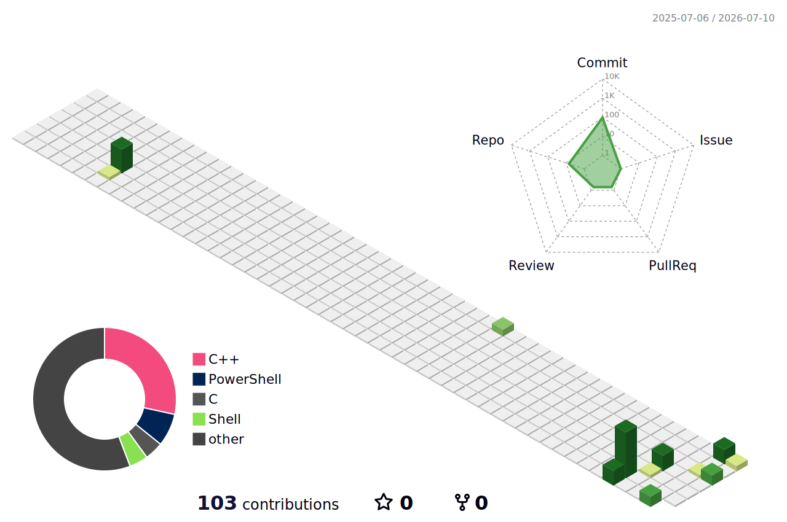

<!-- HEADER WITH TYPING EFFECT -->

  

<!--

  

-->
---

<!--
**Abdullah12021/Abdullah12021** is a ✨ _special_ ✨ repository because its `README.md` (this file) appears on your GitHub profile.

Here are some ideas to get you started:

- 🔭 I’m currently working on ...
- 🌱 I’m currently learning ...
- 👯 I’m looking to collaborate on ...
- 🤔 I’m looking for help with ...
- 💬 Ask me about ...
- 📫 How to reach me: ...
- 😄 Pronouns: ...
- ⚡ Fun fact: ...
-->

<!--This is for snake animation -->
<picture>
  <source media="(prefers-color-scheme: dark)" srcset="https://raw.githubusercontent.com/Abdullah12021/Abdullah12021/output/github-contribution-grid-snake-dark.svg">
  <source media="(prefers-color-scheme: light)" srcset="https://raw.githubusercontent.com/Abdullah12021/Abdullah12021/output/github-contribution-grid-snake.svg">
  
</picture>

  <!-- Glowing Interactive Ring Around The Animation -->
  

    
    <!-- Your Live 3D GitHub Action Asset File -->
    
      
  

